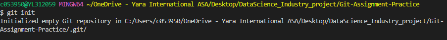
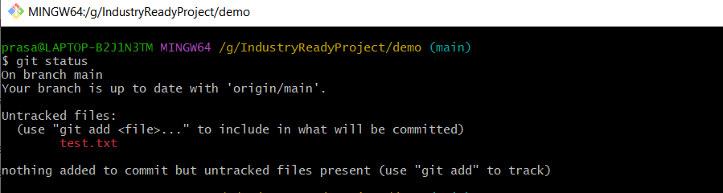
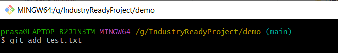

# Basic Git Commands

## 1. git init
    Create a empty Git repositort in the specified directory. 

***Example***

    git init

> ***Result:***

## 2. git clone [url]
    clone repo located at [url] onto local machine. Original repo can be located on the local filesystem or on remote machine via HTTP or SSH

***Example***

    git clone 

> ***Result:***

## 3. git config
    Defining author name to be used for all commits in current repository and used to define email address of the author.

***Example***

    git config user.name 'Prasad Nagineni'
        - Author defined as Prasad Nagineni
    git config user.email 'prasad.nagineni12345@gmail.com
        - configured author email address

> ***Result:***

## 4. git Status 
    Above command used to show the untracked or modified files in current working directory. 

***Example***

    git status

> ***Result:***

## 5. git add [file_name]
    Command is used to add the files to staged area. 

    - use wildcard . to add all the files in working directory to staged area
***Example***
    git add test.txt   # adding file test.txt to staged area

> ***Results:***

    - Added test.txt to staged area
 
    - Added all the new and modifiled files to staged area

## 6. git commit

    Command is used to commit the snapshot of the staged area.

    use git commit -m 'message' : Commit the changes with short summary of the changes.

***Example***

    git commit -m 'This is my first commit'

>***Result:***

## 7. git log
    Display the entire commit history for the current repository.

***Example***

    git log

>***Result:***

## 8. git diff
    Command is used to disaply the unstaged changes your index and working directory.

***Example***

    git diff
    git diff [file_name]        # onlt changes to specific file

>***Result:***

## 9. git branch 
    List all of the branched in current repository. 

    git branch <branch_name>     # Used to created new branch with name 'branch name'

***Example**

    git branch              # Lisf of all branches

    git branch TestBranch   # TestBranch is created

>***Result:***

## 10. git checkout <branch_name>
    Switch from current branch to another branch

***Example***

    git checkout TestBranch

>***Result:***

