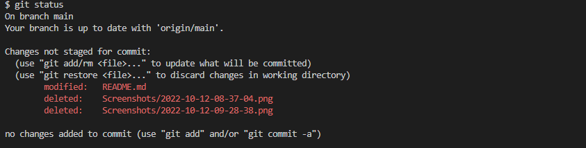
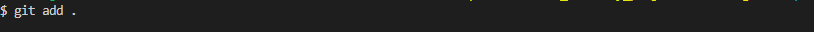

# Basic Git Commands

## 1. Git init
    Create a empty Git repositort in the specified directory. 

***Example***

    git init

> ***Result:***

## 2. Git clone [url]
    clone repo located at [url] onto local machine. Original repo can be located on the local filesystem or on remote machine via HTTP or SSH

***Example***

    git clone 

> ***Result:***

## 3. Git Status 
    Above command used to show the untracked or modified files in current working directory. 

***Example***

    git status

> ***Result:***

## 4. Git add [file_name]
    Command is used to add the files to staged area. 

    - use wildcard . to add all the files in working directory to staged area
***Example***
    git add test.txt   # adding file test.txt to staged area

> ***Results:***

    - Added test.txt to staged area
 
    - Added all the new and modifiled files ro staged area

