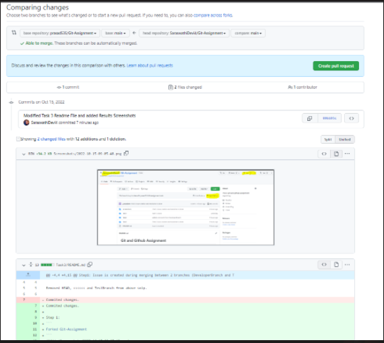
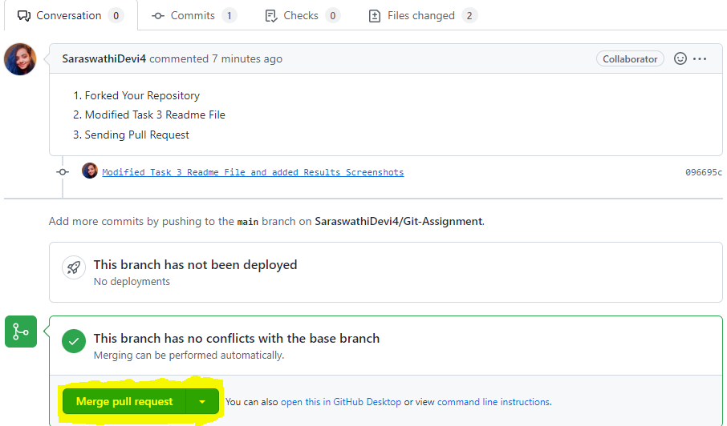

Step1: Issue is created during merging between 2 branches (DeveloperBranch and TestBranch)


Removed HEAD, <<<<<< and TestBranch from above snip.

Commited changes. 

Step 2: 
```
Forked Git-Assignment
```


Step 3:
```
Raising Pull Request
```


step 4:
```
Merged the pull request data.
```


yjfd
duua
awyjf